<!--  README — Daniel Montezano — @DanielMontezano -->

<!-- ══════════════════ BANNER ══════════════════ -->

  

  

  <strong>Desenvolvedor Full Stack em Formação&nbsp; | &nbsp;Programador&nbsp; | &nbsp;Designer</strong>

<!-- ══════════════════ TYPING ══════════════════ --> 

 
  

---

<!-- ══════════════════ SOBRE MIM ══════════════════ -->

<table border="0" cellpadding="16" cellspacing="0">
<tr>

<td valign="top" width="58%">

### ✦ Olá, eu sou o Daniel!

<table border="0" cellpadding="12" cellspacing="0">
<tr>
<td bgcolor="#111111" style="border-radius: 12px;">

✦ **Nome:** Daniel Viana Ferreira Montezano  
✦ **Usuário:** @DanielMontezano  
✦ **Local:** Rio de Janeiro, Brasil  
✦ **Curso:** Análise e Desenvolvimento de Sistemas  
✦ **Período:** 4º período — em andamento  
✦ **Objetivo:** Desenvolvedor Full Stack  

</td>
</tr>
</table>

</td>

<td valign="top" width="42%" align="center">

<!-- GIF/ANIMAÇÃO -->

 

<!-- VISITOR COUNTER -->

 

</td>

</tr>
</table>

---

<!-- ══════════════════ TYPING 2 ══════════════════ --> 

 
 

---

<!-- Text -->
<td valign="middle" width="58%">

### ✦ Sobre mim 

Sou estudante de <strong>Análise e Desenvolvimento de Sistemas (ADS)</strong> e estou sempre buscando aprender, experimentar e evoluir na área de tecnologia. Gosto de transformar ideias em projetos e explorar novas possibilidades através da programação.

Além da tecnologia, gosto de fazer <strong>edição de vídeos</strong> de forma criativa e dinâmica. Estou aprendendo <strong>design</strong> porque gosto de produzir projetos visuais, buscando unir criatividade e tecnologia em tudo que desenvolvo.

Também gosto muito de <strong>jogos, quadrinhos, séries e filmes</strong>, especialmente <strong>Jujutsu Kaisen</strong>. Atualmente, estou aprimorando minhas habilidades em <strong>programação, design e edição de vídeo</strong>, sempre buscando novos desafios e oportunidades para aprender.

<strong>✦ Interesses:</strong> Tecnologia • Programação • Design • Edição e Vídeo • Games

</td>

<!-- ══════════════════ CONTATO ══════════════════ -->
## Contatos

 

  
  &nbsp;&nbsp;
  

<!-- ══════════════════ TECNOLOGIAS ══════════════════ -->
## Tecnologias

<table>
  <tr>
    <td align="center" width="110" height="110">
      
       
      <b>JavaScript</b>
    </td>
    <td align="center" width="110" height="110">
      
       
      <b>TypeScript</b>
    </td>
    <td align="center" width="110" height="110">
      
       
      <b>HTML5</b>
    </td>
    <td align="center" width="110" height="110">
      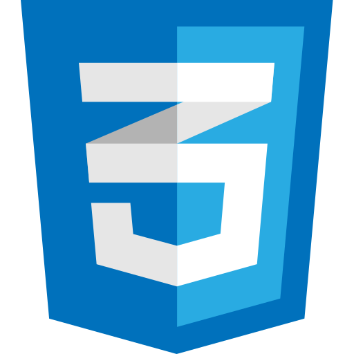
       
      <b>CSS3</b>
    </td>
    <td align="center" width="110" height="110">
      
       
      <b>PHP</b>
    </td>
    <td align="center" width="110" height="110">
      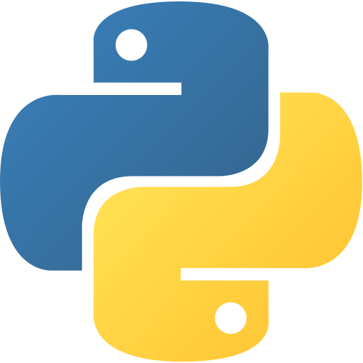
       
      <b>Python</b>
    </td>
    <td align="center" width="110" height="110">
      
       
      <b>Node.js</b>
    </td>
    <td align="center" width="110" height="110">
      
       
      <b>React</b>
    </td>
  </tr>
  <tr>
    <td align="center" width="110" height="110">
      
       
      <b>Next.js</b>
    </td>
    <td align="center" width="110" height="110">
      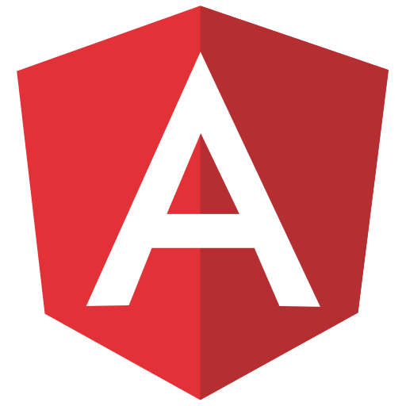
       
      <b>Angular</b>
    </td>
    <td align="center" width="110" height="110">
      
       
      <b>Vue</b>
    </td>
    <td align="center" width="110" height="110">
      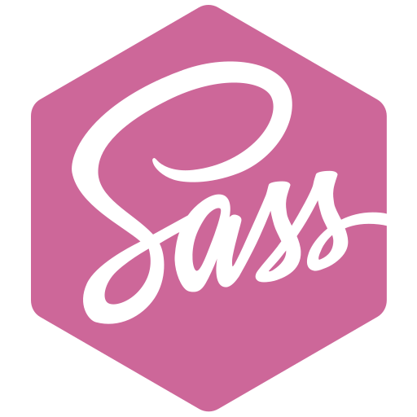
       
      <b>Sass</b>
    </td>
    <td align="center" width="110" height="110">
      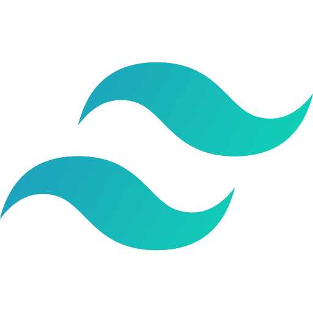
       
      <b>Tailwind</b>
    </td>
    <td align="center" width="110" height="110">
      
       
      <b>MySQL</b>
    </td>
    <td align="center" width="110" height="110">
      
       
      <b>PostgreSQL</b>
    </td>
    <td align="center" width="110" height="110">
      
       
      <b>Firebase</b>
    </td>
  </tr>
  <tr>
    <td align="center" width="110" height="110">
      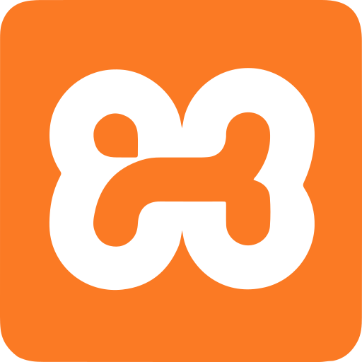
       
      <b>XAMPP</b>
    </td>
    <td align="center" width="110" height="110">
      
       
      <b>Bootstrap</b>
    </td>
    <td align="center" width="110" height="110">
      
       
      <b>Ionic</b>
    </td>
    <td align="center" width="110" height="110">
      
       
      <b>Ruby</b>
    </td>
    <td align="center" width="110" height="110">
      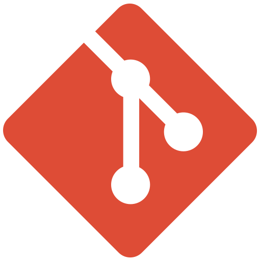
       
      <b>Git</b>
    </td>
    <td align="center" width="110" height="110">
      
       
      <b>Linux</b>
    </td>
    <td align="center" width="110" height="110">
      
       
      <b>Markdown</b>
    </td>
    <td align="center" width="110" height="110">
      
       
      <b>Vite</b>
    </td>
  </tr>
  <tr>
    <td align="center" width="110" height="110">
      
       
      <b>Copilot</b>
    </td>
    <td align="center" width="110" height="110">
      
       
      <b>VSCode</b>
    </td>
    <td align="center" width="110" height="110">
      
       
      <b>Android</b>
    </td>
    <td align="center" width="110" height="110">
      
       
      <b>Godot</b>
    </td>
    <td align="center" width="110" height="110">
      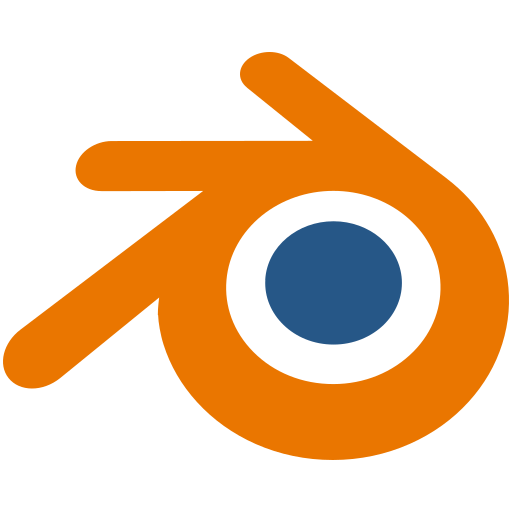
       
      <b>Blender</b>
    </td>
    <td align="center" width="110" height="110">
      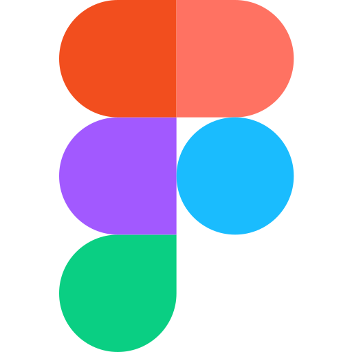
       
      <b>Figma</b>
    </td>
    <td align="center" width="110" height="110">
      
       
      <b>Penpot</b>
    </td>
    <td align="center" width="110" height="110">
      
       
      <b>Affinity</b>
    </td>
  </tr>
  <tr>
    <td align="center" width="110" height="110">
      
       
      <b>Behance</b>
    </td>
    <td align="center" width="110" height="110">
      
       
      <b>Ibis Paint X</b>
    </td>
    <td align="center" width="110" height="110">
      
       
      <b>Clip Studio</b>
    </td>
    <td align="center" width="110" height="110">
      
       
      <b>Krita</b>
    </td>
    <td align="center" width="110" height="110">
      
       
      <b>Aseprite</b>
    </td>
    <td align="center" width="110" height="110">
      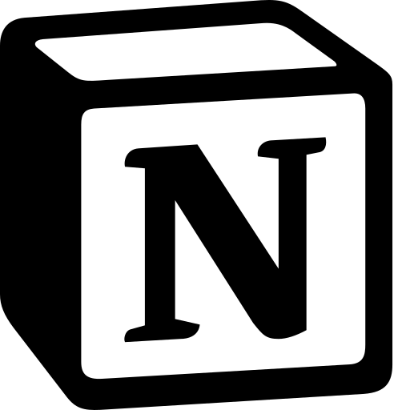
       
      <b>Notion</b>
    </td>
    <td align="center" width="110" height="110">
      
       
      <b>Trello</b>
    </td>
   <td align="center" width="110" height="110">
      
       
      <b>Lua</b>
    </td>
  </tr>
</table>

 

<!-- LOGOS ESPECIAIS (maiores — wordmarks) -->
&nbsp;&nbsp;
&nbsp;&nbsp;
&nbsp;&nbsp;

<!-- BADGES -->

  
  &nbsp;
  
  &nbsp;
  

---

<!-- ══════════════════ GITHUB STATS ══════════════════ -->
## GitHub Stats

  

---

<!-- ══════════════════ ATIVIDADE ══════════════════ -->
## Atividade

  

---

<!-- ══════════════════ INSTAGRAM PESSOAL ══════════════════ -->
## Instagram

Acompanhe um pouco mais sobre mim, meus projetos, interesses e o que faço fora do código.

 

<a href="https://www.instagram.com/daniel_montezano" target="_blank">
  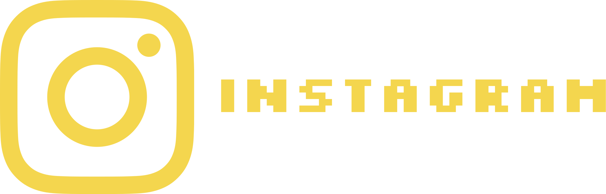
</a>

 

---

<!-- ══════════════════ FOOTER ══════════════════ -->

 
  Feito com dedicação por <strong>Daniel Montezano</strong> · <a href="https://github.com/DanielMontezano">@DanielMontezano</a>
   
  <em>"Cada dia me superando."</em>

---

<!-- ══════════════════ BANDEIRAS / IDIOMA ══════════════════ -->

  
  &nbsp;&nbsp;
  <a href="./README_EN.md">
    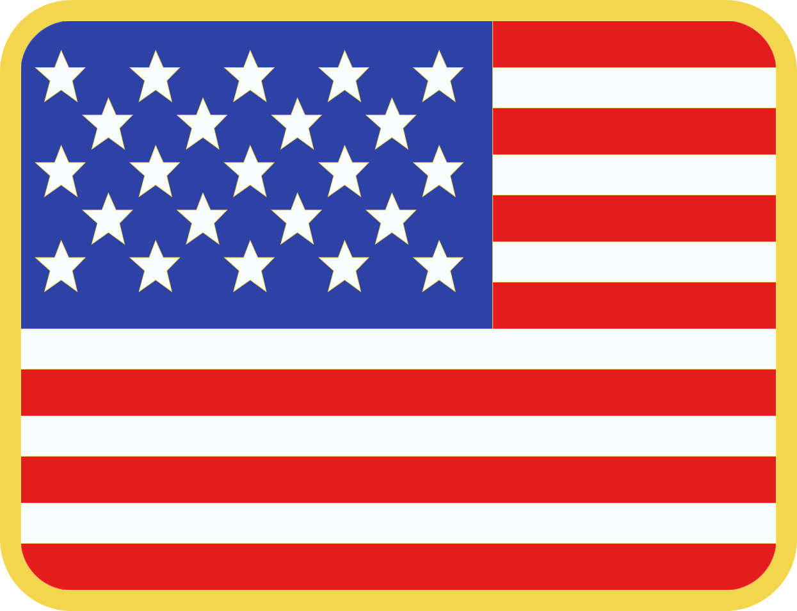
  </a>

